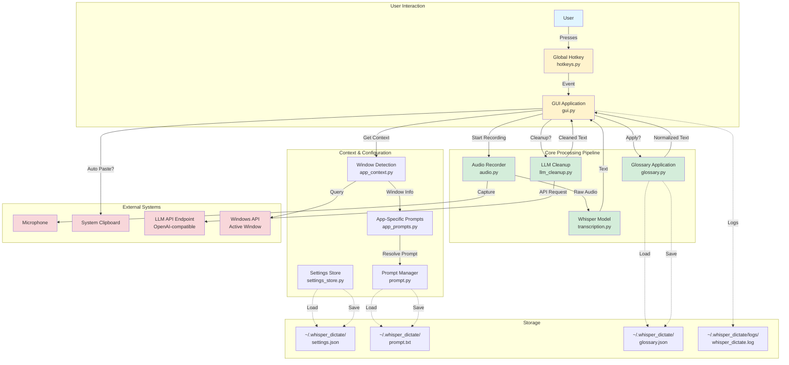
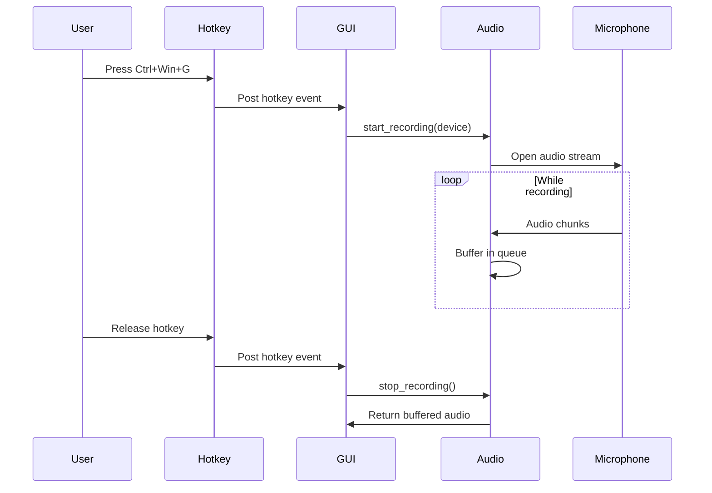
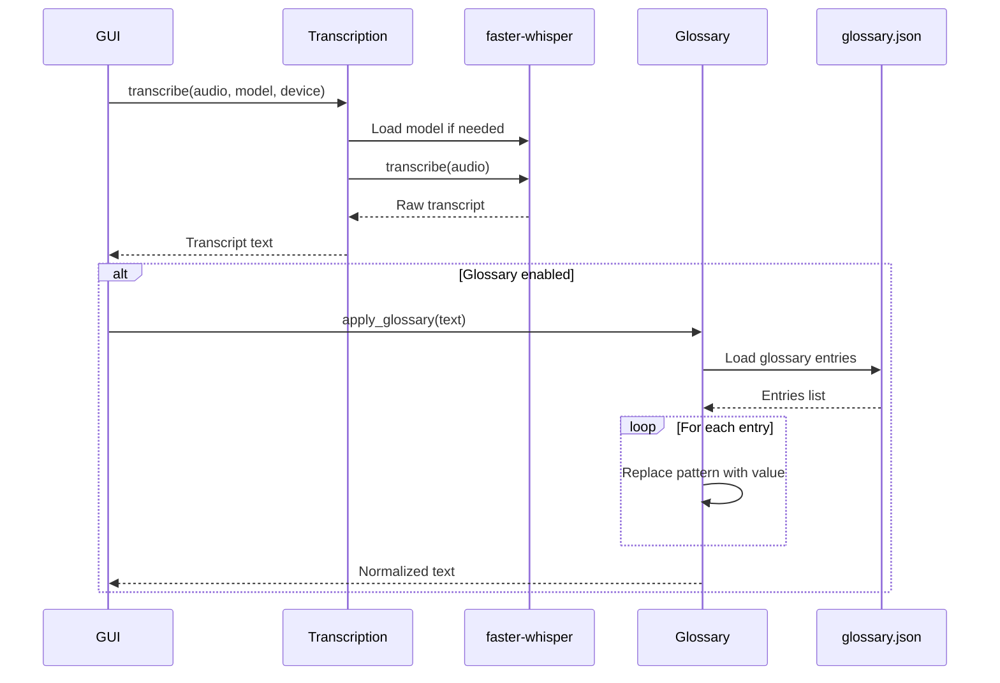
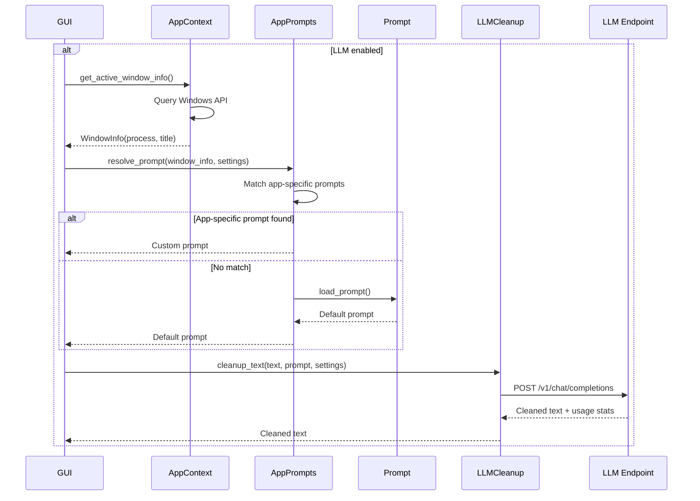
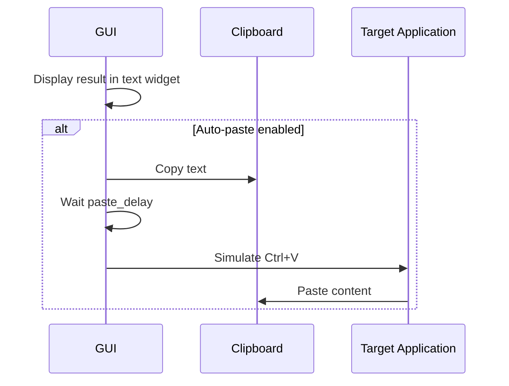
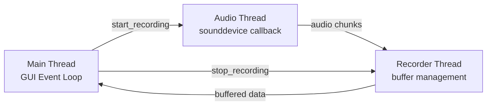

# Architecture

This document provides a visual overview of Whisper Dictate's architecture and data flow.

## System Architecture



## Data Flow

### 1. Recording Trigger


### 2. Transcription Pipeline


### 3. LLM Cleanup (Optional)


### 4. Output & Paste


## Module Responsibilities

| Module | Responsibility | External Dependencies |
|--------|----------------|----------------------|
| `config.py` | Configuration defaults, CUDA setup | nvidia-cublas, nvidia-cudnn |
| `app_context.py` | Active window detection (Windows API) | ctypes (windll.user32, windll.kernel32) |
| `prompt.py` | LLM prompt loading/saving | None |
| `app_prompts.py` | Per-application prompt resolution | None |
| `app_prompt_dialog.py` | GUI for per-app prompt management | tkinter |
| `audio.py` | Audio recording with sounddevice | sounddevice, numpy |
| `transcription.py` | Whisper model loading and transcription | faster-whisper, ctranslate2 |
| `llm_cleanup.py` | LLM text cleanup with OpenAI client | openai |
| `glossary.py` | Glossary persistence and application | None |
| `glossary_dialog.py` | GUI for glossary management | tkinter |
| `hotkeys.py` | Windows global hotkey registration | ctypes (windll.user32) |
| `gui_components.py` | Reusable GUI widgets | tkinter |
| `logging_config.py` | Centralized logging setup | logging |
| `settings_store.py` | Settings persistence | json |
| `gui.py` | Main GUI application | tkinter, pyautogui, pyperclip |

## Key Design Patterns

### Singleton Pattern
- **AudioRecorder**: Global instance via `get_default_recorder()` for backward compatibility
- **Whisper Model**: Cached in `transcription.py` to avoid reloading

### Observer Pattern
- **Hotkeys**: Windows message loop posts events to GUI thread
- **Audio Recording**: Background thread queues chunks, main thread retrieves buffer

### Strategy Pattern
- **App-Specific Prompts**: Different prompts for different applications
- **Glossary**: Configurable find/replace patterns

### Separation of Concerns
- **Business Logic**: Separate modules (audio, transcription, llm_cleanup, glossary)
- **GUI**: Orchestration and display only (`gui.py`)
- **Configuration**: Centralized in `settings_store.py` and `config.py`

## Threading Model



- **Main Thread**: GUI event loop (tkinter), hotkey callbacks, transcription, LLM calls
- **Audio Callback Thread**: sounddevice callback (high priority, minimal processing)
- **Recorder Thread**: Buffer management, queue processing (daemon thread)

## File Structure

```
whisper_dictate/
├── config.py                 # Configuration and CUDA setup
├── app_context.py           # Windows API for active window detection
├── prompt.py                # Prompt file I/O
├── app_prompts.py           # App-specific prompt resolution
├── app_prompt_dialog.py     # GUI for app prompts
├── audio.py                 # AudioRecorder class
├── transcription.py         # Whisper model interface
├── llm_cleanup.py           # OpenAI client wrapper
├── glossary.py              # Glossary logic
├── glossary_dialog.py       # GUI for glossary
├── hotkeys.py               # Windows hotkey registration
├── gui_components.py        # Reusable widgets
├── logging_config.py        # Logging configuration
├── settings_store.py        # Settings persistence
└── gui.py                   # Main application

~/.whisper_dictate/
├── whisper_dictate_settings.json   # User settings
├── whisper_dictate_prompt.txt      # Default LLM prompt
├── whisper_dictate_glossary.json   # Glossary entries
└── logs/
    └── whisper_dictate.log          # Application logs
```

## Error Handling Strategy

- **Specific Exceptions**: Each module catches specific exceptions (OSError, ValueError, etc.)
- **Graceful Degradation**: LLM and glossary failures don't block transcription
- **User Feedback**: Errors displayed in GUI status bar and logged
- **Logging**: Comprehensive logging to `~/.whisper_dictate/logs/whisper_dictate.log`

## Performance Considerations

- **Model Caching**: Whisper model loaded once and reused
- **GPU Acceleration**: CUDA 12.4 + cuDNN 9.5 for faster inference
- **Compute Types**: Configurable (int8_float16, float16, int8)
- **Audio Buffering**: Background thread prevents blocking GUI
- **Lazy Loading**: Models loaded on first use, not at startup
