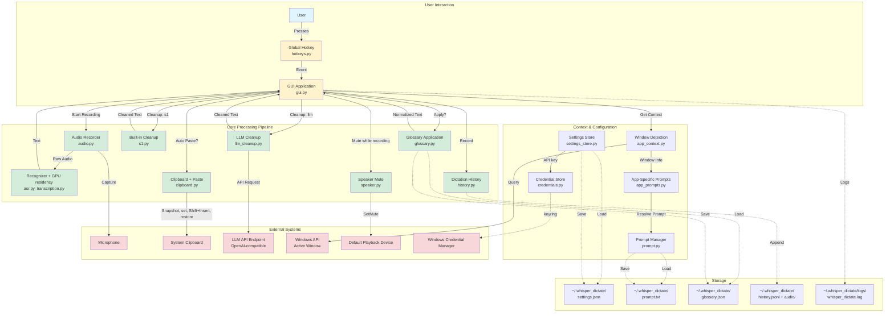
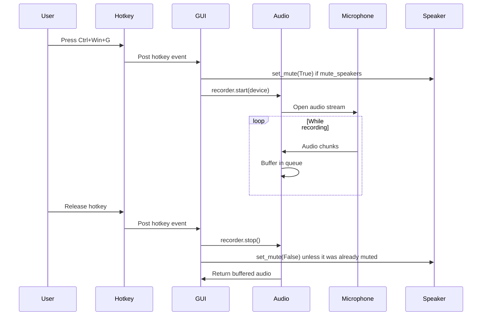
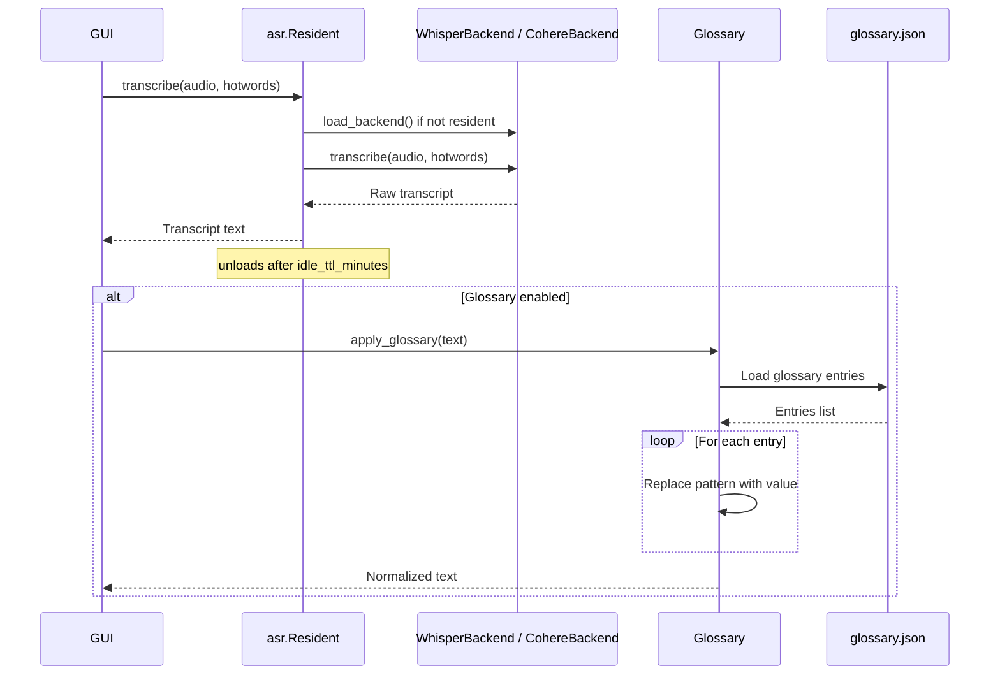
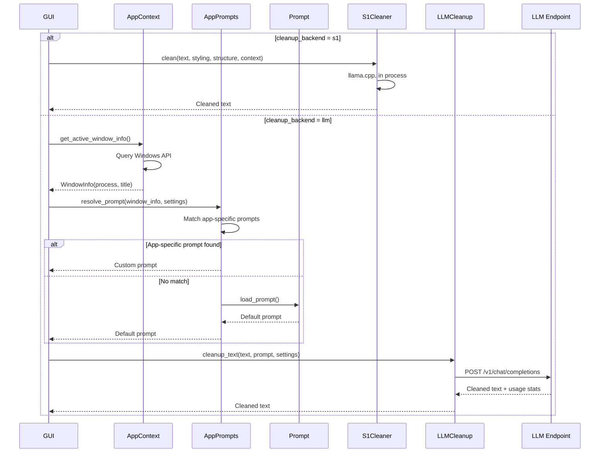
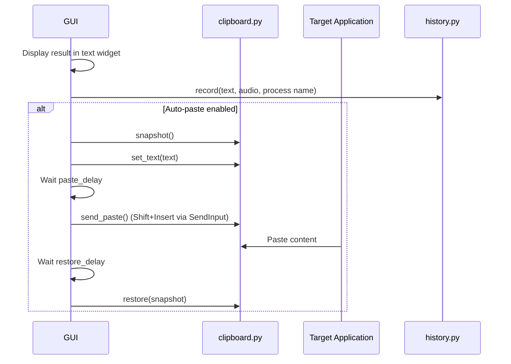
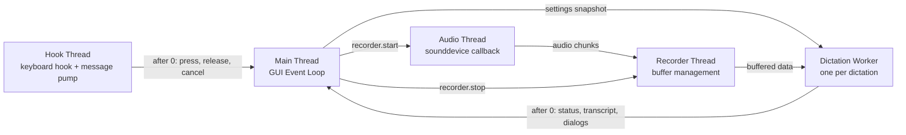

# Architecture

This document provides a visual overview of Whisper Dictate's architecture and data flow.

## System Architecture


```mermaid
graph TB
    subgraph "User Interaction"
        User[User]
        Hotkey[Global Hotkey<br/>hotkeys.py]
        GUI[GUI Application<br/>gui.py]
    end

    subgraph "Core Processing Pipeline"
        Audio[Audio Recorder<br/>audio.py]
        ASR[Recognizer + GPU residency<br/>asr.py, transcription.py]
        Glossary[Glossary Application<br/>glossary.py]
        S1[Built-in Cleanup<br/>s1.py]
        LLM[LLM Cleanup<br/>llm_cleanup.py]
        History[Dictation History<br/>history.py]
        ClipMod[Clipboard + Paste<br/>clipboard.py]
        Speaker[Speaker Mute<br/>speaker.py]
    end

    subgraph "Context & Configuration"
        AppContext[Window Detection<br/>app_context.py]
        AppPrompts[App-Specific Prompts<br/>app_prompts.py]
        Settings[Settings Store<br/>settings_store.py]
        Prompt[Prompt Manager<br/>prompt.py]
        Credentials[Credential Store<br/>credentials.py]
    end

    subgraph "External Systems"
        Microphone[Microphone]
        Clipboard[System Clipboard]
        LLMEndpoint[LLM API Endpoint<br/>OpenAI-compatible]
        WindowsAPI[Windows API<br/>Active Window]
        Playback[Default Playback Device]
        CredMgr[Windows Credential Manager]
    end

    subgraph "Storage"
        SettingsFile[~/.whisper_dictate/<br/>settings.json]
        PromptFile[~/.whisper_dictate/<br/>prompt.txt]
        GlossaryFile[~/.whisper_dictate/<br/>glossary.json]
        HistoryFile[~/.whisper_dictate/<br/>history.jsonl + audio/]
        LogFile[~/.whisper_dictate/logs/<br/>whisper_dictate.log]
    end

    User -->|Presses| Hotkey
    Hotkey -->|Event| GUI
    GUI -->|Mute while recording| Speaker
    Speaker -->|SetMute| Playback
    GUI -->|Start Recording| Audio
    Audio -->|Capture| Microphone
    Audio -->|Raw Audio| ASR
    ASR -->|Text| GUI
    GUI -->|Apply?| Glossary
    Glossary -->|Normalized Text| GUI
    GUI -->|Get Context| AppContext
    AppContext -->|Query| WindowsAPI
    AppContext -->|Window Info| AppPrompts
    AppPrompts -->|Resolve Prompt| Prompt
    GUI -->|Cleanup: s1| S1
    S1 -->|Cleaned Text| GUI
    GUI -->|Cleanup: llm| LLM
    LLM -->|API Request| LLMEndpoint
    LLM -->|Cleaned Text| GUI
    GUI -->|Record| History
    GUI -->|Auto Paste?| ClipMod
    ClipMod -->|Snapshot, set, Shift+Insert, restore| Clipboard

    Settings -.->|Load| SettingsFile
    Settings -.->|Save| SettingsFile
    Prompt -.->|Load| PromptFile
    Prompt -.->|Save| PromptFile
    Glossary -.->|Load| GlossaryFile
    Glossary -.->|Save| GlossaryFile
    History -.->|Append| HistoryFile
    Settings -->|API key| Credentials
    Credentials -.->|keyring| CredMgr
    GUI -.->|Logs| LogFile

    style User fill:#e1f5ff
    style Hotkey fill:#fff3cd
    style GUI fill:#fff3cd
    style Audio fill:#d4edda
    style ASR fill:#d4edda
    style Glossary fill:#d4edda
    style S1 fill:#d4edda
    style LLM fill:#d4edda
    style History fill:#d4edda
    style ClipMod fill:#d4edda
    style Speaker fill:#d4edda
    style Microphone fill:#f8d7da
    style Clipboard fill:#f8d7da
    style LLMEndpoint fill:#f8d7da
    style WindowsAPI fill:#f8d7da
    style Playback fill:#f8d7da
    style CredMgr fill:#f8d7da
```

## Data Flow

### 1. Recording Trigger

```mermaid
sequenceDiagram
    participant User
    participant Hotkey
    participant GUI
    participant Audio
    participant Mic as Microphone

    participant Speaker

    User->>Hotkey: Press Ctrl+Win+G
    Hotkey->>GUI: Post hotkey event
    GUI->>Speaker: set_mute(True) if mute_speakers
    GUI->>Audio: recorder.start(device)
    Audio->>Mic: Open audio stream
    loop While recording
        Mic->>Audio: Audio chunks
        Audio->>Audio: Buffer in queue
    end
    User->>Hotkey: Release hotkey
    Hotkey->>GUI: Post hotkey event
    GUI->>Audio: recorder.stop()
    GUI->>Speaker: set_mute(False) unless it was already muted
    Audio->>GUI: Return buffered audio
```

### 2. Transcription Pipeline

```mermaid
sequenceDiagram
    participant GUI
    participant Trans as asr.Resident
    participant Whisper as WhisperBackend / CohereBackend
    participant Glos as Glossary
    participant GlosFile as glossary.json

    GUI->>Trans: transcribe(audio, hotwords)
    Trans->>Whisper: load_backend() if not resident
    Trans->>Whisper: transcribe(audio, hotwords)
    Whisper-->>Trans: Raw transcript
    Trans-->>GUI: Transcript text
    Note over Trans: unloads after idle_ttl_minutes

    alt Glossary enabled
        GUI->>Glos: apply_glossary(text)
        Glos->>GlosFile: Load glossary entries
        GlosFile-->>Glos: Entries list
        loop For each entry
            Glos->>Glos: Replace pattern with value
        end
        Glos-->>GUI: Normalized text
    end
```

### 3. Cleanup (Optional: S1-mini or LLM)

```mermaid
sequenceDiagram
    participant GUI
    participant AppCtx as AppContext
    participant AppPr as AppPrompts
    participant Prompt
    participant S1 as S1Cleaner
    participant LLM as LLMCleanup
    participant API as LLM Endpoint

    alt cleanup_backend = s1
        GUI->>S1: clean(text, styling, structure, context)
        S1->>S1: llama.cpp, in process
        S1-->>GUI: Cleaned text
    else cleanup_backend = llm
        GUI->>AppCtx: get_active_window_info()
        AppCtx->>AppCtx: Query Windows API
        AppCtx-->>GUI: WindowInfo(process, title)

        GUI->>AppPr: resolve_prompt(window_info, settings)
        AppPr->>AppPr: Match app-specific prompts
        alt App-specific prompt found
            AppPr-->>GUI: Custom prompt
        else No match
            AppPr->>Prompt: load_prompt()
            Prompt-->>AppPr: Default prompt
            AppPr-->>GUI: Default prompt
        end

        GUI->>LLM: cleanup_text(text, prompt, settings)
        LLM->>API: POST /v1/chat/completions
        API-->>LLM: Cleaned text + usage stats
        LLM-->>GUI: Cleaned text
    end
```

### 4. Output, Paste & History

```mermaid
sequenceDiagram
    participant GUI
    participant Clip as clipboard.py
    participant Target as Target Application
    participant History as history.py

    GUI->>GUI: Display result in text widget
    GUI->>History: record(text, audio, process name)

    alt Auto-paste enabled
        GUI->>Clip: snapshot()
        GUI->>Clip: set_text(text)
        GUI->>GUI: Wait paste_delay
        GUI->>Clip: send_paste() (Shift+Insert via SendInput)
        Target->>Clip: Paste content
        GUI->>GUI: Wait restore_delay
        GUI->>Clip: restore(snapshot)
    end
```

Shift+Insert rather than Ctrl+V because terminals and most editors honour it and
Ctrl+V is bound elsewhere in several of them. The snapshot and restore keep whatever
was on the clipboard before the dictation.

## Module Responsibilities

| Module | Responsibility | External Dependencies |
|--------|----------------|----------------------|
| `config.py` | Configuration defaults, CUDA setup | nvidia-cublas, nvidia-cuda-runtime |
| `app_context.py` | Active window detection (Windows API) | ctypes (windll.user32, windll.kernel32) |
| `prompt.py` | LLM prompt loading/saving | None |
| `app_prompts.py` | Per-application prompt resolution | None |
| `app_prompt_dialog.py` | GUI for per-app prompt management | tkinter |
| `audio.py` | Audio recording with sounddevice | sounddevice, numpy |
| `transcription.py` | Whisper model loading and transcription | faster-whisper, ctranslate2 |
| `asr.py` | Recognizer backends (Whisper, Cohere) and `Resident` idle unload | numpy; torch, transformers (Cohere only) |
| `llm_cleanup.py` | LLM text cleanup with OpenAI client | openai |
| `s1.py` | Built-in cleanup with S1-mini | llama-cpp-python, huggingface_hub |
| `glossary.py` | Glossary persistence, phonetic rules, per-app hotwords | None |
| `glossary_dialog.py` | GUI for glossary rules and the Fix last dictation dialog | tkinter |
| `history.py` | Dictation record (`history.jsonl`) and audio pruning | numpy, wave |
| `hotkeys.py` | Windows global hotkey registration | ctypes (windll.user32) |
| `clipboard.py` | Clipboard snapshot/restore and Shift+Insert paste | ctypes (windll.user32, kernel32) |
| `speaker.py` | Mute the default playback device while recording | ctypes (Core Audio COM) |
| `credentials.py` | API key storage in Windows Credential Manager | keyring |
| `gui_components.py` | Reusable GUI widgets, floating status pill | tkinter |
| `logging_config.py` | Centralized logging setup | logging |
| `settings_store.py` | Settings persistence; moves `llm_key` to `credentials.py` | json |
| `gui.py` | Main GUI application | tkinter |

## Key Design Patterns

### Single Instances
- **AudioRecorder**: One instance, held by `App` as `self.recorder`
- **Recognizer and cleanup model**: Held by `asr.Resident`, which loads on demand and unloads after the idle TTL

### Observer Pattern
- **Hotkeys**: Windows message loop posts events to GUI thread
- **Audio Recording**: Background thread queues chunks, main thread retrieves buffer

### Strategy Pattern
- **App-Specific Prompts**: Different prompts for different applications
- **Glossary**: Configurable find/replace patterns

### Separation of Concerns
- **Business Logic**: Separate modules (audio, transcription, llm_cleanup, glossary)
- **GUI**: Orchestration and display only (`gui.py`)
- **Configuration**: Centralized in `settings_store.py` and `config.py`

## Threading Model


```mermaid
graph LR
    MainThread[Main Thread<br/>GUI Event Loop]
    AudioThread[Audio Thread<br/>sounddevice callback]
    RecorderThread[Recorder Thread<br/>buffer management]

    HookThread[Hook Thread<br/>keyboard hook + message pump]
    Worker[Dictation Worker<br/>one per dictation]

    HookThread -->|after 0: press, release, cancel| MainThread
    MainThread -->|recorder.start| AudioThread
    AudioThread -->|audio chunks| RecorderThread
    MainThread -->|recorder.stop| RecorderThread
    MainThread -->|settings snapshot| Worker
    RecorderThread -->|buffered data| Worker
    Worker -->|after 0: status, transcript, dialogs| MainThread
```

- **Main Thread**: the Tk event loop, and the only thread that touches a Tk variable or widget. Hook events reach it through `after(0, ...)`.
- **Hook Thread**: the low-level keyboard hook and its message pump (`hotkeys.py`). It never calls Tk directly.
- **Dictation Worker**: transcription, cleanup and delivery (`_transcribe_and_clean`, `_clean_with_s1`, `_deliver`). `_stop_and_transcribe` copies the settings out of Tk on the main thread (`_capture_dictation_config`) and hands the worker that dict. The worker reads the snapshot and never touches Tk; status, the transcript box and error dialogs go back through `after(0, ...)`.
- **Loader Threads**: `asr.Resident` builds the recognizer and the cleanup model off the main thread, from `_asr_config` and `_s1_style`, which are captured the same way.
- **Audio Callback Thread**: sounddevice callback (high priority, minimal processing)
- **Recorder Thread**: Buffer management, queue processing (daemon thread)

Touching Tk from any other thread deadlocks whenever the main thread is inside a Tcl
callback, a modal dialog for one.

## File Structure

```
whisper_dictate/
├── config.py                 # Configuration and CUDA setup
├── app_context.py           # Windows API for active window detection
├── prompt.py                # Prompt file I/O
├── app_prompts.py           # App-specific prompt resolution
├── app_prompt_dialog.py     # GUI for app prompts
├── audio.py                 # AudioRecorder class
├── transcription.py         # Whisper model interface
├── asr.py                   # Recognizer backends and GPU residency
├── llm_cleanup.py           # OpenAI client wrapper
├── s1.py                    # S1-mini cleanup (llama.cpp)
├── glossary.py              # Glossary logic
├── glossary_dialog.py       # GUI for glossary and Fix last dictation
├── history.py               # Dictation record and audio pruning
├── hotkeys.py               # Windows hotkey registration
├── clipboard.py             # Clipboard snapshot/restore, Shift+Insert paste
├── speaker.py               # Mute playback device while recording
├── credentials.py           # Windows Credential Manager (keyring)
├── gui_components.py        # Reusable widgets
├── logging_config.py        # Logging configuration
├── settings_store.py        # Settings persistence
└── gui.py                   # Main application

~/.whisper_dictate/
├── whisper_dictate_settings.json   # User settings
├── whisper_dictate_prompt.txt      # Default LLM prompt
├── whisper_dictate_glossary.json   # Glossary entries
├── history.jsonl                   # One line per dictation (process name, never window title)
├── audio/                          # Dictation audio, pruned after history_audio_days
└── logs/
    └── whisper_dictate.log          # Application logs
```

## Error Handling Strategy

- **Specific Exceptions**: Each module catches specific exceptions (OSError, ValueError, etc.)
- **Graceful Degradation**: LLM and glossary failures don't block transcription
- **User Feedback**: Errors displayed in GUI status bar and logged
- **Logging**: Comprehensive logging to `~/.whisper_dictate/logs/whisper_dictate.log`

## Performance Considerations

- **Model Residency**: `asr.Resident` loads the recognizer and cleanup model on demand and frees them after `idle_ttl_minutes`, since the GPU is shared with other services
- **GPU Acceleration**: CUDA 12.4 wheels for faster-whisper and llama-cpp, CUDA 13.0 for torch
- **Compute Types**: Configurable (int8_float16, float16, int8)
- **Audio Buffering**: Background thread prevents blocking GUI
- **Lazy Loading**: Models loaded on first use, not at startup
